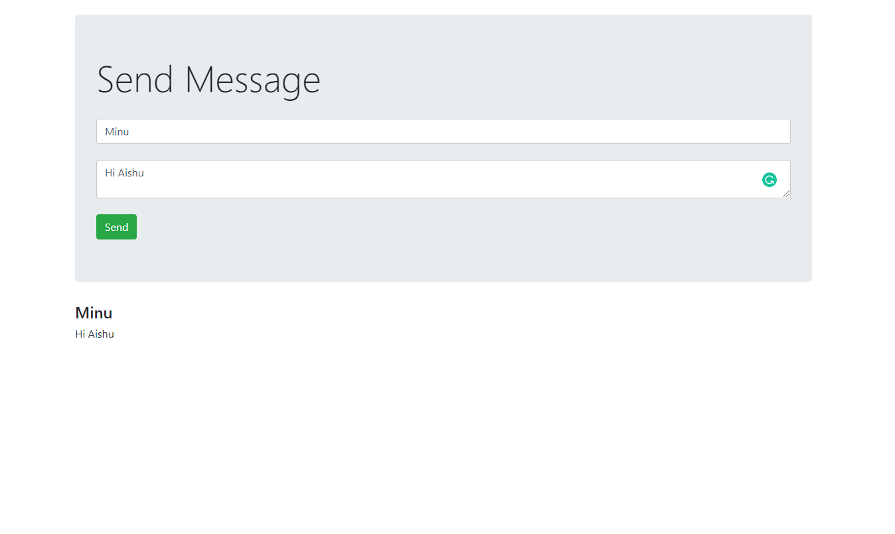
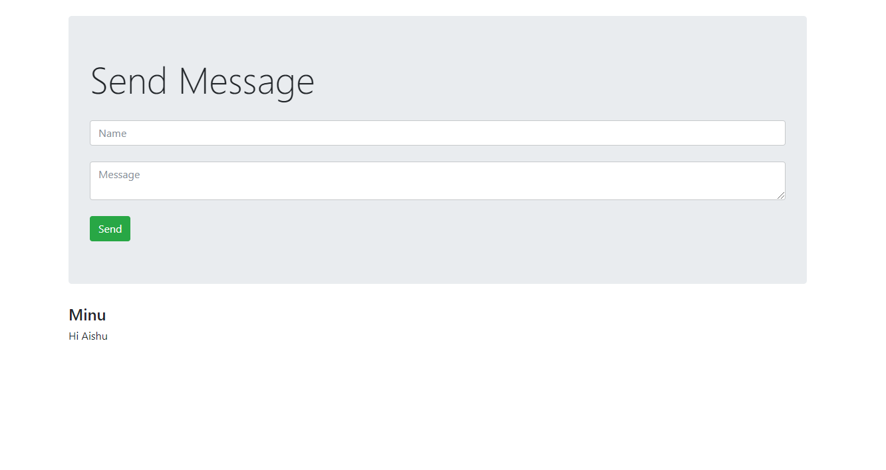
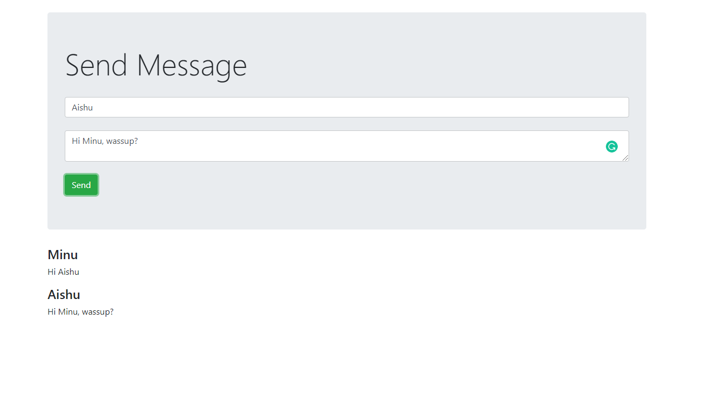
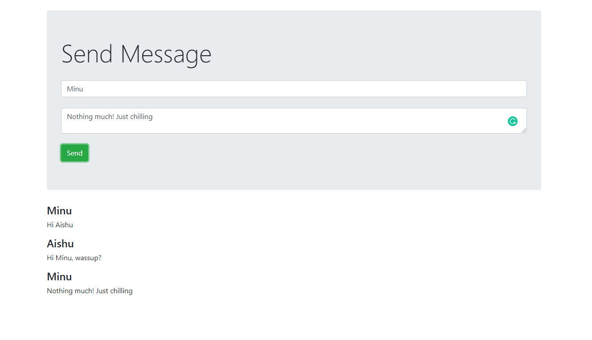
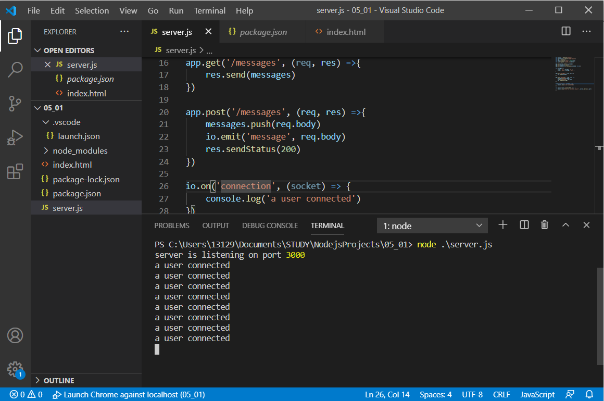

# Messaging-App
A chat app built using node.js framework of javascript.

Node.js is a platform built on the Chrome JavaScript runtime that can help you build fast, scalable network applications. 
Node.js uses an event-driven, non-blocking I/O model that makes it lightweight and efficient—perfect for data-intensive real-time applications that run across distributed devices. In this project, I learned the topics such as npm, reading and writing files, and Node.js frameworks.

# Snapshots of the app

# 1) Person 1 sends a message

# 2) Person 2 recieves the message

# 3) Person 2 sends the message to person 1

# 4) Person 1 recieves the message and sends another message to person 2

# 5) This is the terminal showing the users connected to the server
The server is listening to port 3000 using the socket.io

